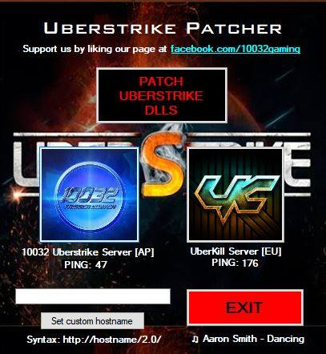

# UberStrike Patcher
Simple UberStrike Patcher that uses ficture7's dlls to enable connections to custom servers.

This tool will modify 3 .dlls so we are able to connect non-profit reverse engineered UberStrike servers.

`Assembly-CSharp.dll`
`Assembly-CSharp-firstpass.dll`
`UnityEngine.dll`

Working Directory `C:\Program Files (x86)\Steam\steamapps\common\UberStrike`

Our UberStrike Server WILL contain bugs please do not report to us and wait until UberKill releases.

By using this tool you agree 10032 Gaming will not be held responsible for any damages caused; including but not exclusive to lawsuits and copyright claims.

Servers used by the tool:
UberKill Server is owned and run by Patrik Nagy.
10032 Uberstrike Server is run by Anjum9694.

www.facebook.com/10032gaming/

